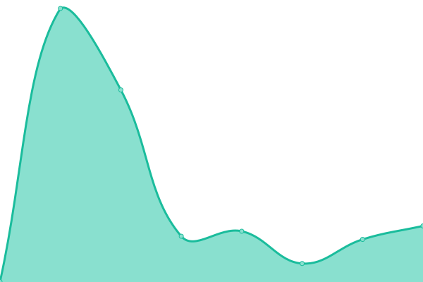

# [📈 Live Status](https://demo.upptime.js.org): <!--live status--> **🟧 Partial outage**

This repository contains the open-source uptime monitor and status page for [Upptime](https://upptime.js.org), powered by [Upptime](https://github.com/upptime/upptime).

With [Upptime](https://upptime.js.org), you can get your own unlimited and free uptime monitor and status page, powered entirely by a GitHub repository. We use [Issues](https://github.com/upptime/upptime/issues) as incident reports, [Actions](https://github.com/peterpicard/upptime/actions) as uptime monitors, and [Pages](https://demo.upptime.js.org) for the status page.

<!--start: status pages-->
<!-- This summary is generated by Upptime (https://github.com/upptime/upptime) -->
<!-- Do not edit this manually, your changes will be overwritten -->
<!-- prettier-ignore -->
| URL | Status | History | Response Time | Uptime |
| --- | ------ | ------- | ------------- | ------ |
|  [Google](https://www.google.com) | 🟩 Up | [google.yml](https://github.com/peterpicard/upptime/commits/HEAD/history/google.yml) | 

 111ms
     
 | 

<a href="https://upptime.bidniss.com/history/google">100.00%</a>
    

|  [Bidniss - WWW](https://www.bidniss.com) | 🟩 Up | [bidniss-www.yml](https://github.com/peterpicard/upptime/commits/HEAD/history/bidniss-www.yml) | 

 402ms
     
 | 

<a href="https://upptime.bidniss.com/history/bidniss-www">100.00%</a>
    

|  [Bidniss - Wifi](https://wifi.bidniss.com) | 🟥 Down | [bidniss-wifi.yml](https://github.com/peterpicard/upptime/commits/HEAD/history/bidniss-wifi.yml) | 

 343ms
     
 | 

<a href="https://upptime.bidniss.com/history/bidniss-wifi">0.02%</a>
    

|  [Bidniss - Public](https://public.bidniss.com) | 🟩 Up | [bidniss-public.yml](https://github.com/peterpicard/upptime/commits/HEAD/history/bidniss-public.yml) | 

 684ms
     
 | 

<a href="https://upptime.bidniss.com/history/bidniss-public">0.07%</a>
    

|  [Bidniss - Test](http://106.70.24.21) | 🟩 Up | [bidniss-test.yml](https://github.com/peterpicard/upptime/commits/HEAD/history/bidniss-test.yml) | 

 388ms
     
 | 

<a href="https://upptime.bidniss.com/history/bidniss-test">100.00%</a>
    

<!--end: status pages-->

[**Visit our status website →**](https://demo.upptime.js.org)

## 📄 License

- Powered by: [Upptime](https://github.com/upptime/upptime)
- Code: [MIT](./LICENSE) © [Upptime](https://upptime.js.org)
- Data in the `./history` directory: [Open Database License](https://opendatacommons.org/licenses/odbl/1-0/)
